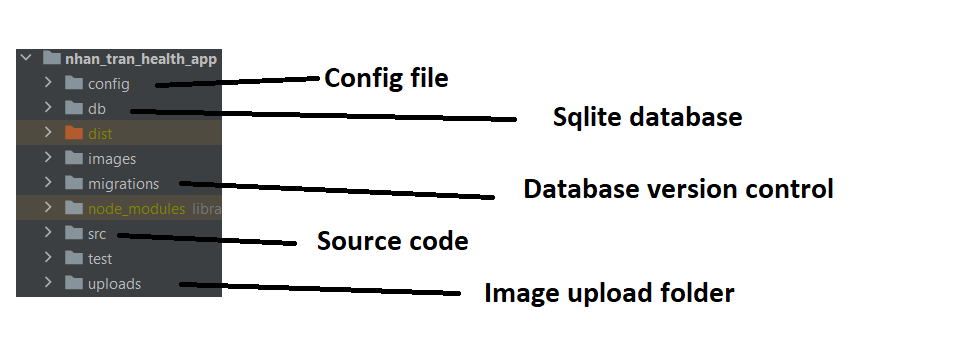
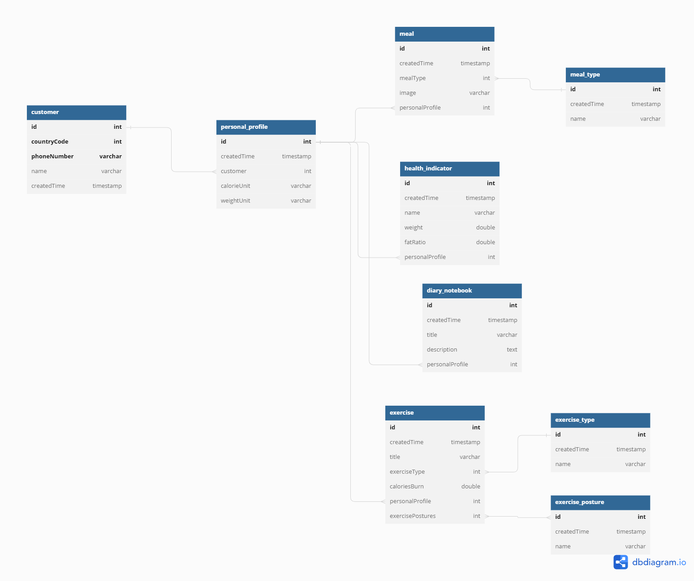
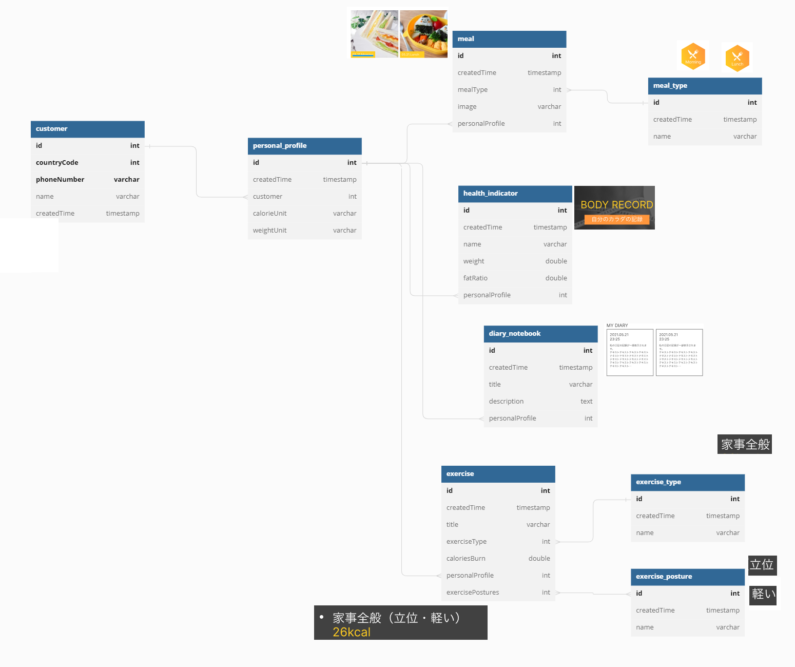
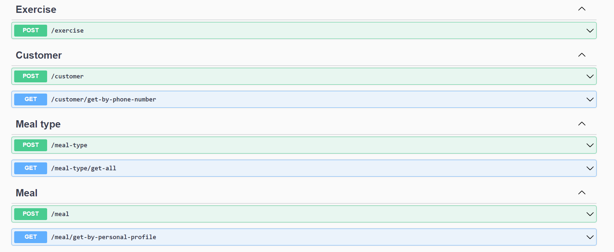

### HealthApp

### Requirement

```bash
NodeJs >= 16.x
npm i -g @nestjs/cli
```

### Running the app

```bash
$ npm run start
```

### Project structure



### Database design



Relationship between Database and UI Design




The project is based on the assumption that the customer is already logged into the system

Project include sample data (customer_id: 1, personal_profile_id: 1)

### API input / output 

Each zone represents each part of the system

- Swagger - http://localhost:3000/api#/


Get home page information

```bash
curl -X 'GET' \
  'http://localhost:3000/personal-profile/1/range?start_date=2022-12-01&end_date=2022-12-05' \
  -H 'accept: */*'
```
